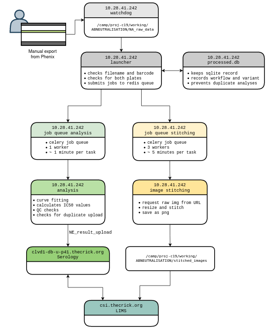

# Neutralisation analysis launcher


Launches plaque neutralisation analyses when new data is added to a directory.

Uses watchdog to monitor for filesystem changes, redis and celery to create an
analysis job-queue.



## Requirements
This requires an installation of redis-server, celery and a MySQL driver.

- Redis 6.0.10
- Celery 4.4.7
- Celery flower (optional)
- watchdog
- plaque_assay


## To run:
1. Start redis if not already running
```
redis-server
```

2. Start celery in the working directory  
```
celery -A task worker -Q analysis --concurrency=1 --loglevel=INFO -E -n analysis
celery -A task worker -Q image_stitch --concurrency=3 --loglevel=INFO -E -n image_stitcher
```

3. Start watchdog to monitor filesystem  
```
python main.py
```

(optional) flower to monitor celery jobs  
```
celery --broker=redis://localhost flower -A task --address=0.0.0.0 --port=5555 --basic_auth={username}:{password}
```


## To re-analyse previously run jobs:
Analysis jobs are stored in a local sqlite database to stop duplicate entries
into the LIMS. To re-analyse anything (in case of an error before LIMS upload) you have to delete that entry from `processed_experiments.sqlite`
